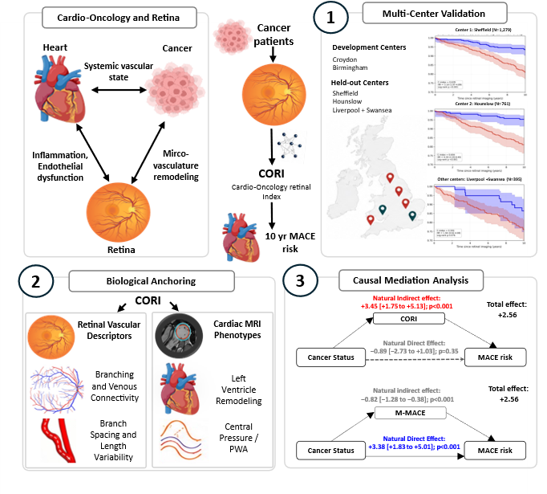

# Cardio-Oncology Retinal Index for Early Cardiovascular Risk Stratification in Cancer Patients

## Project layout

```text
CORI_analysis_clean/
├── notebooks/
│   ├── 101_main_clean.ipynb
│   ├── 102_mediation_clean.ipynb
│   └── 103_proteomics_clean.ipynb
├── scripts/
│   ├── run_main.py
│   ├── run_mediation.py
│   └── run_proteomics.py
├── src/
│   ├── cori_analysis/
│   │   ├── config.py              # all paths, columns, thresholds, model settings
│   │   ├── common.py              # logging, output folders, formatting, IDs
│   │   ├── cohorts.py             # cancer/non-cancer cohorts, splits, treatment, CMR reshape
│   │   ├── survival.py            # Cox feature selection, training, locking, scoring
│   │   ├── clinical_data.py       # exact clinical merge + legacy-compatible policies
│   │   ├── clinical_models.py     # clinical/CORI/stacked Cox models
│   │   ├── evaluation.py          # C-index, HR, interactions, CMR statistics
│   │   ├── plots.py               # KM, forest, alluvial, subgroup plots
│   │   ├── visualization.py       # reclassification, CMR, triangle plots
│   │   ├── cmr.py                 # CMR preprocessing and curated families
│   │   ├── treatment.py           # treatment-adjusted Cox models
│   │   ├── handcrafted.py         # handcrafted retinal feature/model utilities
│   │   ├── mediation.py           # one configurable mediation implementation
│   │   ├── proteomics.py          # differential proteomics and comparison plot
│   │   └── pipelines/             # H1, H2, H3, H4 and handcrafted experiment runners
│   └── *.py                       # thin compatibility wrappers for old imports
├── tests/
├── pyproject.toml
├── requirements.txt
```



## Installation

From the project directory:

```bash
python -m venv .venv
# Windows: .venv\Scripts\activate
# macOS/Linux: source .venv/bin/activate
python -m pip install --upgrade pip
python -m pip install -e ".[notebooks,dev]"
pytest -q
```

## Configure data paths

The only paths to edit are in `DataPaths`. 

```python
from pathlib import Path
from cori_analysis.config import AnalysisConfig, DataPaths

config = AnalysisConfig(
    paths=DataPaths(
        input_dir=Path('./data'),
        output_dir=Path('./figures'),
        handcrafted_feature_dir=Path('./data/handcrafted_features'),
        cardiac_mri_csv='cardiac_mri.csv',
        proteomics_csv=Path('./data/proteomics_50k_instance_0_sdf.csv'),
    )
)
```

Expected inputs under `input_dir`:

```text
CORI_allcancer_8Jan_ALL_COLUMNS_with_retfound_features.csv
cohort2_noncancer_mace_with_retfound.csv
risk_score_df_final_shared_22April_2026.csv
chemo_status.csv
cardiac_mri.csv
final_df_HTN_DB_Status.csv
source_population_with_retinal_scores.csv
alz_proteomics_columns.txt
```

The clinical file defaults to exact columns `eid`, `HTN`, `Diabetes`, and `sex`. Change `ColumnSchema` in the configuration when your file uses different exact names

## Run the full analysis

```bash
python scripts/run_main.py \
  --input-dir ./data \
  --output-dir ./figures \
  --handcrafted-dir ./data/handcrafted_features
```

Useful switches:

```bash
python scripts/run_main.py --skip-handcrafted
python scripts/run_main.py --rebuild-handcrafted-cache
```

The same workflow is available cell-by-cell in `notebooks/101_main_clean.ipynb`.

## Run mediation

Primary analysis:

```bash
python scripts/run_mediation.py --n-rep 500
```

Cancer-status-adjusted mediator sensitivity analysis:

```bash
python scripts/run_mediation.py \
  --adjust-mediator-for-cancer-status \
  --n-rep 50
```

## Run proteomics

```bash
python scripts/run_proteomics.py \
  --proteomics-file ./data/proteomics_50k_instance_0_sdf.csv \
  --protein-columns-file ./data/alz_proteomics_columns.txt
```

